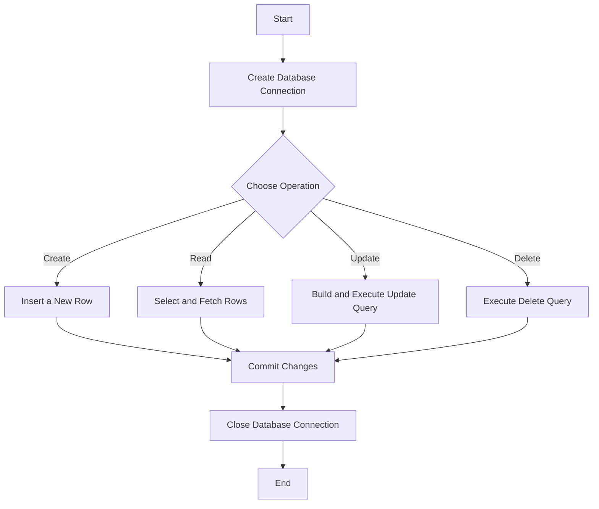

# Python SQLite CRUD Example

This repository demonstrates how to create a basic Python project that interacts with an SQLite database. The project includes methods for performing CRUD (Create, Read, Update, Delete) operations, showcasing how to work with SQLite databases using Python's built-in `sqlite3` module.

To preview this markdown in VS Code:
- On Windows/Linux: `Ctrl + Shift + V`
- On macOS: `Cmd + Shift + V`

A useful VS Code extension to view the diagrams is: [Markdown Preview Mermaid Support](https://marketplace.visualstudio.com/items?itemName=bierner.markdown-mermaid)

## Table of Contents
1. [Getting Started](#getting-started)
2. [CRUD Operations](#crud-operations)
3. [Diagrams](#diagrams)
4. [Explanation of (id,)](#explanation-of-id)

## Getting Started

### Prerequisites
- Python 3.x installed on your system.
- VS Code or any code editor of your choice.
- Basic understanding of Python.

### Setup Instructions

1. **Clone the Repository**
   ```bash
   git clone https://github.com/your-username/python-sqlite-crud-example.git
   cd python-sqlite-crud-example
   ```

2. **Create a Virtual Environment**
   Create a virtual environment to manage dependencies and isolate the project environment.
   ```bash
   python3 -m venv venv
   ```

3. **Activate the Virtual Environment**
   - On Windows:
     ```bash
     .\venv\Scripts\activate
     ```
   - On macOS/Linux:
     ```bash
     source venv/bin/activate
     ```

4. **Install Dependencies**
   Since `sqlite3` is included with Python, no additional packages need to be installed. If you plan to use other dependencies in the future, you can install them using `pip`:
   ```bash
   pip install -r requirements.txt
   ```

5. **Set Up the Database**
   Run the `database_setup.py` script to create the SQLite database and table:
   ```bash
   python3 database_setup.py
   ```

6. **Run the CRUD Operations**
   Test the CRUD operations by running the `main.py` script:
   ```bash
   python3 main.py
   ```

## CRUD Operations

This project demonstrates basic CRUD operations on an SQLite database using Python's `sqlite3` module. Below is an explanation of each operation:

### 1. **Create (Insert a Row)**
   - **Function**: `insert_row`
   - **Purpose**: Adds a new record to the `my_table`.
   - **How it works**:
     - Connects to the SQLite database.
     - Executes an `INSERT INTO` SQL statement to add a new row with the provided values.
     - Commits the transaction and closes the connection.

### 2. **Read (Retrieve Rows)**
   - **Function**: `read_rows`
   - **Purpose**: Fetches all rows from the `my_table`.
   - **How it works**:
     - Connects to the SQLite database.
     - Executes a `SELECT *` SQL statement to retrieve all rows.
     - Fetches all rows and returns them.

### 3. **Update (Modify a Row)**
   - **Function**: `update_row`
   - **Purpose**: Updates specific columns of a row in the `my_table`.
   - **How it works**:
     - Connects to the SQLite database.
     - Dynamically builds an `UPDATE` SQL statement based on the provided parameters.
     - Executes the `UPDATE` statement, modifying the specified row by `id`.
     - Commits the transaction and closes the connection.

### 4. **Delete (Remove a Row)**
   - **Function**: `delete_row`
   - **Purpose**: Removes a specific row from the `my_table`.
   - **How it works**:
     - Connects to the SQLite database.
     - Executes a `DELETE FROM` SQL statement to remove the row by `id`.
     - Commits the transaction and closes the connection.

## Diagrams

### CRUD Operations Flow



### Database Schema


The diagram above outlines the basic flow of CRUD operations and shows the structure of the SQLite database table used in this project.

## Explanation of `(id,)`

In Python, `(id,)` is a way to create a tuple containing a single element, `id`. Here's a detailed breakdown:

- **Tuples**: A tuple is an ordered and immutable collection in Python. Tuples are defined by enclosing elements in parentheses `()`.
- **Why `(id,)`?**:
  - When creating a tuple with one element, a trailing comma is needed to differentiate it from a regular expression enclosed in parentheses.
  - Without the comma, Python interprets the parentheses as just grouping rather than creating a tuple.

### Examples
1. **Without Comma**:
   ```python
   id = 5
   single = (id)
   print(single)  # Output: 5
   print(type(single))  # Output: <class 'int'>
   ```
   - `single` is not a tuple, but an integer.

2. **With Comma**:
   ```python
   id = 5
   single_tuple = (id,)
   print(single_tuple)  # Output: (5,)
   print(type(single_tuple))  # Output: <class 'tuple'>
   ```
   - `single_tuple` is a tuple containing a single element `5`.

### Usage in Context
This syntax is often used when passing a single value as a tuple, such as when executing SQL queries with parameterized inputs using `sqlite3` or other database modules:
```python
cursor.execute('DELETE FROM my_table WHERE id = ?', (id,))
```
Here, `(id,)` ensures `id` is passed as a tuple, even if it contains only one element.

## Passing Multiple Values

If you have multiple values to pass as a tuple in Python, include all the values separated by commas within the parentheses. Here's how you can pass multiple values:

### Example with Multiple Values
If you want to insert multiple values into an SQLite database using `sqlite3`, you can structure it like this:

```python
# Assuming you have a table with columns 'name', 'age', and 'email'
cursor.execute('INSERT INTO my_table (name, age, email) VALUES (?, ?, ?)', ('John Doe', 30, 'john@example.com'))
```

In this example, `('John Doe', 30, 'john@example.com')` is a tuple containing three values.

### Explanation

- **Multiple Values Tuple**: When you have more than one element, you separate them with commas, and you don't need to add a trailing comma.
  
  ```python
  values = ('John Doe', 30, 'john@example.com')
  ```

- **Using with SQL Statement**: When passing multiple values to an SQL statement, you can use the tuple directly to replace placeholders in the statement.

  ```python
  cursor.execute('INSERT INTO my_table (name, age, email) VALUES (?, ?, ?)', values)
  ```

### Examples with Multiple Values in Different Operations

1. **Insert Operation**:
   ```python
   cursor.execute('INSERT INTO my_table (name, age, email) VALUES (?, ?, ?)', ('Alice', 25, 'alice@example.com'))
   ```

2. **Update Operation**:
   ```python
   # Update a row with multiple values
   cursor.execute('UPDATE my_table SET name = ?, age = ? WHERE email = ?', ('Bob', 28, 'bob@example.com'))
   ```

3. **Delete Operation with Multiple Conditions**:
   ```python
   cursor.execute('DELETE FROM my_table WHERE name = ? AND age = ?', ('Alice', 25))
   ```

### Summary
- **Single Value**: Use `(id,)` with a trailing comma to indicate a tuple with one element.
- **Multiple Values**: Use `(value1, value2, value3)` without the trailing comma to create a tuple with multiple elements.

Tuples are a common way to pass multiple parameters safely into SQL statements, as they help prevent SQL injection attacks by automatically escaping the values.
